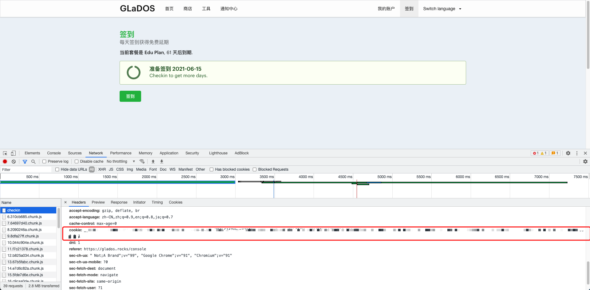

# GLaDOS机场自动签到服务器版
因为github的Action不知道什么时候会干掉自动签到脚本（比如米游社的签到已经被干掉了），所以写了这个服务器版的。

机场地址：https://glados.rocks/

**注册、填写邀请码可以获得5天免费使用：JBRNX-L3XXC-Q1BHD-I8HNT**

### 获取方式
1. git clone git@github.com:VincentXWD/glados_checkin_server.git
2. docker pull kirailol/glados_checkin:latest

### Usage
0. 自行获取COOKIE
1. docker build -t glados_checkin . -f ./Dockerfile
2. docker run -dit --restart unless-stopped --name=glados_checkin -d glados_checkin "\<Your COOKIE\>"

### COOKIE获取
1. 打开 chrome, 登录到 glados 控制台, 找到签到按钮, 按 F12, 拿到 cookie

2. 复制COOKIE到Usage中的步骤2对应位置。